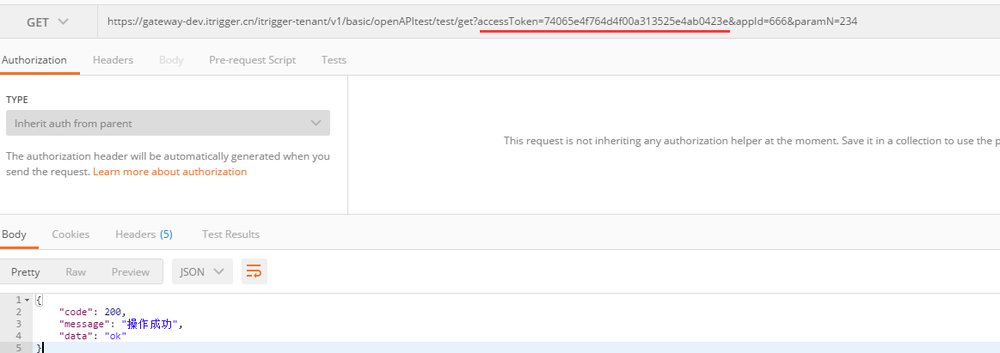

# 开始接入

### 1. 获取应用ID\(APPID\) 和 应用密钥\(APPSECRET\) <a id="OpenAPI&#x4E09;&#x65B9;&#x8C03;&#x7528;&#x65B9;&#x5F0F;&#xFF08;&#x5BF9;&#x5916;&#xFF09;-1.&#x83B7;&#x53D6;&#x5E94;&#x7528;ID(APPID)&#x548C;&#x5E94;&#x7528;&#x5BC6;&#x94A5;(APPSECRET)"></a>

联系企加云技术人员获取应用ID\(APPID\) 和 应用密钥\(APPSECRET\)，因为每个应用都有对应的API列表，需要在申请应用ID和应用密钥时提前沟通好需要开通的API范围

### 2. 获取令牌\(ACCESSTOKEN\) <a id="OpenAPI&#x4E09;&#x65B9;&#x8C03;&#x7528;&#x65B9;&#x5F0F;&#xFF08;&#x5BF9;&#x5916;&#xFF09;-2.&#x83B7;&#x53D6;&#x4EE4;&#x724C;(ACCESSTOKEN)"></a>

通过企加云官方地址获取调取接口所需的令\(ACCESSTOKEN\), 后续所有openAPI都通过此令牌通信

         a. 考虑到三方应用使用的便利性，我们为三方提供**appId,appSecret**作为接口调用的关键凭证，三方通过调用企加云的授权方法获得对应的**accessToken**， 后续所有请求都需要携带accessToken

         b. accessToken接在url的尾部， **GET**请求则在其后添加其他业务参数， **POST**请求则在请求body中携带其他业务参数

         c. 建议三方应用使用中控服务器**统一获取和刷新**accessToken，其他业务逻辑服务器所使用的accessToken均来自于该中控服务器，不应该各自去刷新，否则容易造成冲突，导致accessToken覆盖而影响业务

         d. accessToken的有效期目前是2小时。三方应用的中控服务器需要根据这个有效时间提前去刷新新accessToken，中控服务器不仅需要内部定时**主动刷新**，还需要提供**被动刷新**accessToken的接口，这样便于业务服务器在API调用获知accessToken已超时的情况下，可以触发accessToken的刷新流程

         e. 每个租户每天可以获取accessToken的**次数会有一定限制**，超过后则无法获取

         f. 三方应用可以调用的**API列表**需要先在企加云平台进行申请，通过后才能访问，否则无权限访问

**接口调用请求说明（注意：**gateway-dev.itrigger.cn是日常开发地址，不同环境时会切换**\)**

```text
https请求方式: GET
https://gateway-dev.itrigger.cn/itrigger-tenant/v1/basic/accessTokenOpen/token?appId=APPID&appSecret=APPSECRET
```

**参数说明**

| 参数 | 是否必须 | 说明 |
| :--- | :--- | :--- |
| **appId** | 是 | 第三方用户唯一凭证 |
| appSecret | 是 | 第三方用户唯一凭证密钥 |

**返回说明**

正常情况下，返回下述JSON数据：

```text
{
    "code": 200,
    "message": "操作成功",
    "data":
    {
        "accessToken": "ACCESSTOKEN"
    }
}
```

**参数说明**

| 参数 | 说明 |
| :--- | :--- |
| code | 状态码，200表示成功 |
| message | 状态信息 |
| data | 返回内容 |
| accessToken | 获取到的令牌 |

**返回码说明**

| 返回码 | 说明 |
| :--- | :--- |
| 40001 | appId或appSecret为空 |
| 40002 | appId或appSecret格式不正确 |
| 40003 | 应用appId已被冻结 |
| 40004 | 超过租户调用次数限制 |


### 3. 调用具体的API <a id="OpenAPI&#x4E09;&#x65B9;&#x8C03;&#x7528;&#x65B9;&#x5F0F;&#xFF08;&#x5BF9;&#x5916;&#xFF09;-3.&#x8C03;&#x7528;&#x5177;&#x4F53;&#x7684;API"></a>

调用方式只有GET和POST方式，需要严格按照提供的文档调用

**以下为GET调用示例**

* /itrigger-tenant/v1/basic/openAPItest/test/get 是访问的APIName， 需要预先向企加云提交API申请
* GET请求后面必须带accessToken
* 其他参数全部跟到url后面



**以下为POST调用示例**

* /itrigger-tenant/v1/basic/openAPItest/test/post 是访问的APIName， 需要预先向企加云提交API申请
* POST请求url后面只能带accessToken，其余参数都会被忽略
* 其他参数全部放到body中
* 下图为网关请求示例：


